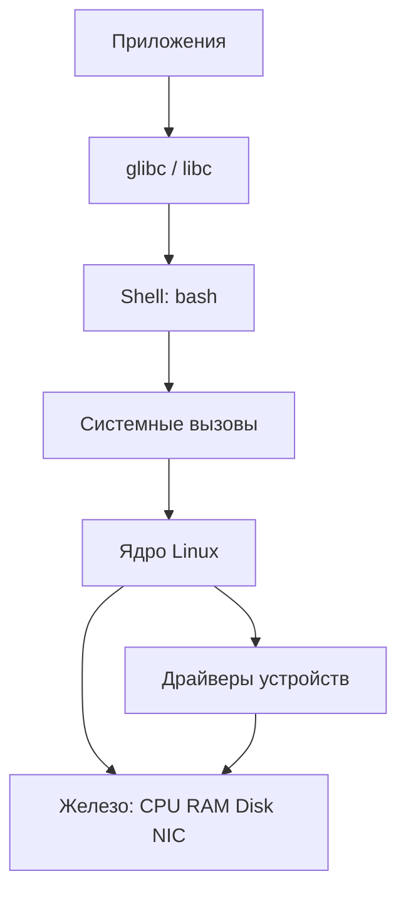

# 01 — Архитектура Linux

**Мнемоника: KUPU** — *Kernel, Userspace, Processes, Users*

## Схема слоёв



## Таблица: сущность → где смотреть

| Слой | Что делает | Файл / команда | Признак проблемы |
|------|------------|----------------|------------------|
| Userspace | программы пользователя | `ps aux`, `ls /proc` | процесс жрёт 100% CPU |
| Ядро | планировщик, память, I/O | `uname -r`, `dmesg` | Oops в dmesg |
| Драйвер | связь с железом | `lsmod`, `lspci` | устройство не видно |
| /proc | интерфейс к ядру | `cat /proc/cpuinfo` | — |
| /sys | конфигурация ядра | `ls /sys/class/` | — |

## Дерево решений

```
Система тормозит?
├── CPU 100%? → ps aux --sort=-%cpu | head
├── RAM полна? → free -h && cat /proc/meminfo
├── Диск? → iostat / df -h
└── Сеть? → ss -tuln
```

## Команда проверки

```bash
uname -a && cat /proc/version && nproc && free -h
```

## Практика

→ `bash-security-toolkit/user_audit.sh`