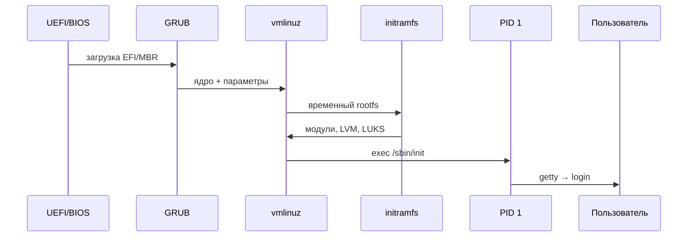

# 02 — Загрузка системы

**Мнемоника: UGKIS** — *UEFI → GRUB → Kernel → initramfs → systemd*

## Схема загрузки



## Таблица этапов

| Этап | Что происходит | Где смотреть | Типичная ошибка |
|------|----------------|--------------|-----------------|
| Firmware | POST, выбор диска | BIOS/UEFI setup | неверный boot order |
| GRUB | меню, параметры ядра | `/boot/grub/`, `grub.cfg` | grub rescue> / нет меню |
| Kernel | драйверы, mount root | `dmesg`, `journalctl -b` | не найден root |
| initramfs | crypto, LVM, NFS root | `lsinitrd` (dracut) / `lsinitramfs` (Debian) / `lsinitcpio` (Arch) | не открыт LUKS |
| systemd | unit-файлы, targets | `systemctl list-units` | зависший сервис |

## Дерево решений

```
Не грузится?
├── GRUB виден? → проверить /boot, grub-install
├── Kernel panic? → dmesg, параметры root=
├── Зависает на login? → systemctl --failed
└── Медленная загрузка? → systemd-analyze blame
```

## Команды

```bash
systemd-analyze
systemd-analyze blame | head -10
journalctl -b -p err
ls -la /boot/vmlinuz* /boot/initramfs* 2>/dev/null || ls -la /boot/
```

## Практика

→ `user_audit.sh` (проверка сервисов и автозапуска)