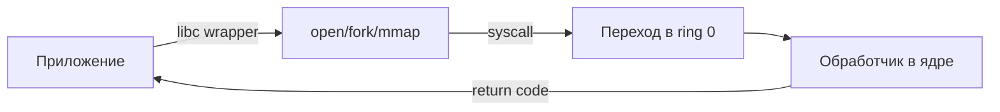

# 03 — Системные вызовы

**Мнемоника: UKU** — *User mode → Kernel → User (return)*

## Схема syscall



## Ключевые вызовы

| Syscall | Что делает | Обёртка libc | Когда смотреть |
|---------|------------|--------------|----------------|
| `fork` | клон процесса | `fork()` | новые процессы |
| `execve` | замена образа | `execve()` | запуск программ |
| `open/read/write` | файловый I/O | `fopen/fread` | доступ к файлам |
| `mmap` | отображение памяти | `mmap()` | shared lib, heap |
| `socket` | сеть | `socket()` | сетевые приложения |
| `kill` | сигнал процессу | `kill()` | завершение |
| `wait4` | ждать потомка | `wait()` | зомби-процессы |

## Таблица отладки

| Задача | Команда | Что увидишь |
|--------|---------|-------------|
| Трассировка syscalls | `strace -f ./program` | все вызовы ядра |
| Только сеть | `strace -e trace=network` | socket/connect |
| Только файлы | `strace -e trace=file` | open/stat |
| Живой процесс | `strace -p PID` | что делает сейчас |

## Дерево решений

```
Программа падает?
├── Permission denied? → strace, смотреть open/access
├── Segfault? → dmesg, gdb, core dump
├── Зависает? → strace -p PID (на чём блокируется)
└── Медленная? → strace -c (статистика syscalls)
```

## Практика

→ `user_audit.sh` + `strace -c ls -la` (разовая тренировка)