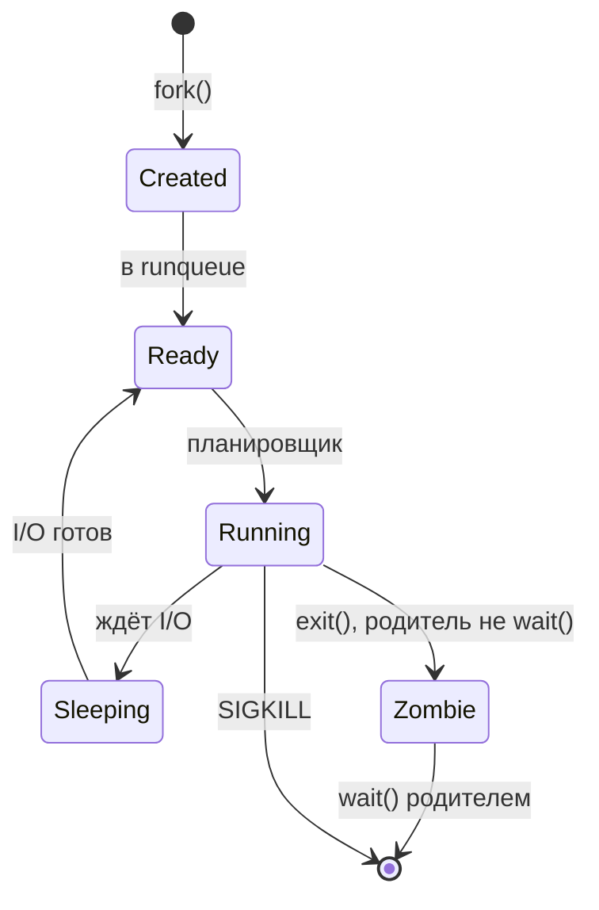

# 04 — Процессы

**Мнемоника: FET** — *Fork → Exec → Terminate*

## Жизненный цикл



## Состояния процесса

| Состояние | Код ps | Причина | Действие |
|-----------|--------|---------|----------|
| Running | R | выполняется | `top -p PID` |
| Sleeping | S | ждёт событие | `strace -p PID` |
| Disk sleep | D | uninterruptible I/O | проверить диск/NFS |
| Zombie | Z | нет wait() | найти родителя PPID |
| Stopped | T | SIGSTOP | `kill -CONT PID` |

## Таблица: сущность → команда

| Сущность | Файл / команда | Поле |
|----------|----------------|------|
| PID | `/proc/PID/status` | первая строка |
| PPID (родитель) | `/proc/PID/status` | PPid |
| Командная строка | `/proc/PID/cmdline` | — |
| FD (открытые файлы) | `ls -l /proc/PID/fd` | — |
| Окружение | `/proc/PID/environ` | — |
| Лимиты | `/proc/PID/limits` | Max open files |

## Дерево решений

```
Много процессов / подозрительная активность?
├── Zombie (Z)? → ps -eo pid,ppid,stat,cmd | awk '$3~/Z/'
├── Один жрёт CPU? → ps aux --sort=-%cpu | head
├── Скрытое имя? → cat /proc/PID/comm vs cmdline
└── Кто породил? → pstree -p PID
```

## Практика

→ `bash-security-toolkit/user_audit.sh`