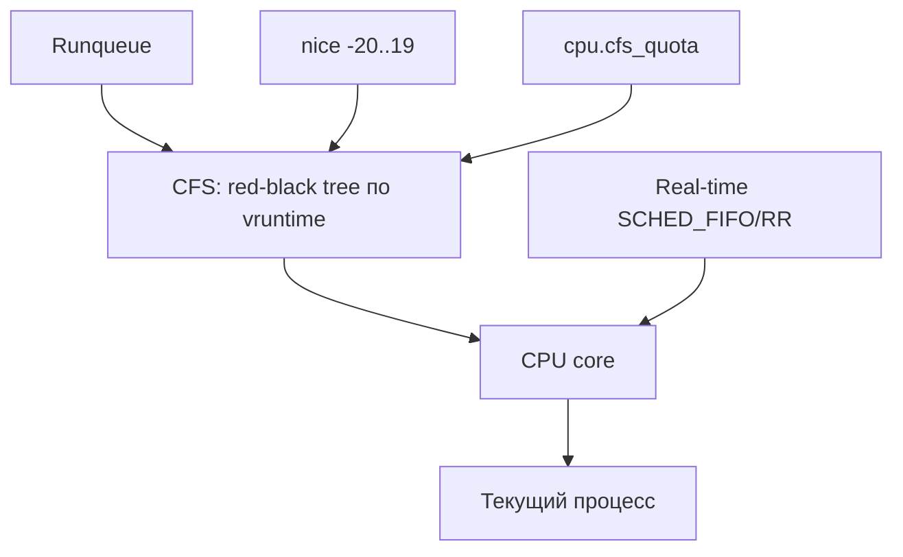

# 05 — Планировщик (CFS)

**Мнемоника: CFS = Completely Fair Scheduler — «дерево справедливости»**

## Схема



## Таблица приоритетов

| Параметр | Диапазон | Команда | Эффект |
|----------|----------|---------|--------|
| nice | -20 (высший) … 19 (низший) | `nice -n 10 cmd` | вес CPU |
| priority | 0–139 | `ps -eo pid,ni,pri,cmd` | ниже = важнее |
| policy | SCHED_OTHER/FIFO/RR | `chrt -p PID` | RT вытесняет CFS |
| cgroup CPU | quota/period | `cat /sys/fs/cgroup/.../cpu.max` | лимит в Docker |

## Дерево решений

```
Процесс медленный / не отвечает?
├── CPU bound? → top -H -p PID (потоки)
├── I/O bound? → iotop / pidstat -d
├── RT процесс голодит? → ps -eo pid,cls,rtprio,cmd
└── Контейнер лимитирован? → docker stats / cgroup cpu.max
```

## Команды

```bash
ps -eo pid,ni,pri,psr,stat,cmd --sort=-ni | head -15
chrt -p $(pgrep -n systemd) 2>/dev/null || true
cat /proc/sched_debug 2>/dev/null | head -5 || echo "нужен root"
```

## Практика

→ `user_audit.sh` (топ CPU-процессов)