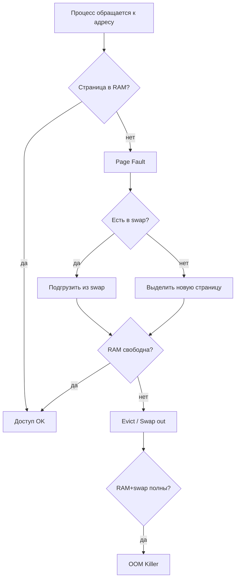

# 06 — Память

**Мнемоника: VPS** — *Virtual memory → Paging → Swap*

## Схема page fault



## Таблица: тип памяти → где смотреть

| Тип | Описание | Команда / файл |
|-----|----------|----------------|
| Virtual | адресное пространство процесса | `/proc/PID/maps` |
| RSS | реально в RAM | `/proc/PID/status` VmRSS |
| Swap | вытесненные страницы | `VmSwap` в status |
| Page cache | кэш файлов | `free -h` → buff/cache |
| Huge pages | большие страницы | `/proc/meminfo` HugePages_* |
| OOM score | кандидат на убийство | `/proc/PID/oom_score` |

## Дерево решений

```
Память заканчивается?
├── Кто жрёт? → ps aux --sort=-%mem | head
├── Утечка? → watch -n1 cat /proc/PID/status | grep VmRSS
├── Swap активен? → vmstat 1 (si/so > 0)
└── OOM в логах? → dmesg | grep -i oom
```

## Команды

```bash
free -h
cat /proc/meminfo | head -20
vmstat 1 3
```

## Практика

→ `log_analyzer.sh` (OOM-события в syslog/dmesg)