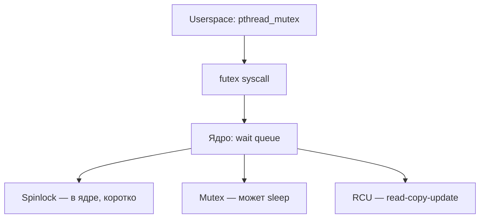

# 07 — Синхронизация

**Мнемоника: MSFR** — *Mutex, Semaphore, Futex, RCU*

## Схема уровней



## Таблица примитивов

| Примитив | Где | Блокирует | Когда использовать |
|----------|-----|-----------|-------------------|
| Spinlock | ядро | busy-wait | очень короткая критическая секция |
| Mutex | ядро/userspace | sleep | длиннее, userspace |
| Semaphore | ядро | sleep + счётчик | пул ресурсов |
| Futex | userspace→ядро | гибрид | основа pthread mutex |
| RCU | ядро | lock-free read | списки в ядре, сеть |

## Дерево решений (для админа)

```
Процесс завис (D state)?
├── NFS / сеть? → mount, ping сервер
├── Диск? → iostat, smartctl
├── Mutex deadlock? → strace -p PID (futex)
└── Высокий load, мало CPU? → iowait в top
```

## Команды

```bash
# futex-ожидания в strace
strace -e futex -p PID 2>&1 | head -20
# блокировки в /proc
ls /proc/locks 2>/dev/null && cat /proc/locks | head
```

## Практика

→ `user_audit.sh` (процессы в состоянии D)