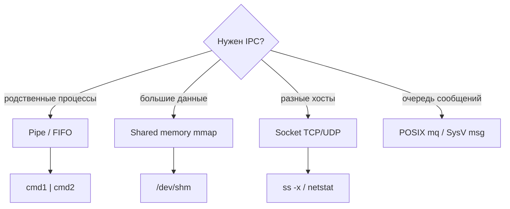

# 08 — Межпроцессное взаимодействие (IPC)

**Мнемоника: PFMS** — *Pipe, FIFO, mmap (shared mem), Socket*

## Схема выбора IPC



## Таблица сравнения

| Метод | Скорость | Связь | Файл / команда |
|-------|----------|-------|----------------|
| Pipe | высокая | родственные | `ls -l /proc/PID/fd` |
| FIFO | средняя | любые, same host | `mkfifo`, в `/tmp` |
| Shared mem | очень высокая | договорённость | `ipcs -m`, `/dev/shm` |
| Unix socket | высокая | same host | `ss -x` |
| TCP socket | средняя | любые | `ss -tlnp` |
| D-Bus | средняя | system bus | `busctl`, systemd |

## Дерево решений

```
Подозрительный IPC?
├── Неизвестный unix socket? → ss -xnp
├── Shared memory? → ipcs -m
├── SysV sem/msg? → ipcs -a
└── Слушает порт? → ss -tlnp | grep PID
```

## Команды

```bash
ipcs -a
ss -xnp 2>/dev/null | head -20
ls -la /dev/shm/
```

## Практика

→ `log_analyzer.sh` (сетевые события в логах)