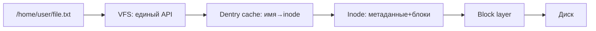

# 09 — Файловые системы

**Мнемоника: VID** — *VFS → Inode → Dentry*

## Схема пути к файлу



## Таблица: уровень → что хранит

| Уровень | Содержимое | Команда | Аномалия |
|---------|------------|---------|----------|
| VFS | open/read/write для всех FS | `cat /proc/mounts` | remount ro |
| Dentry | кэш имён каталогов | `/proc/slabinfo` (dentry), `slabtop` | — |
| Inode | права, размер, блоки | `ls -i`, `stat` | inode exhaustion |
| Superblock | метаданные ФС | `dumpe2fs` | corrupt FS |
| Journal | журнал транзакций | `tune2fs -l` | — |

## FHS — ключевые каталоги

| Каталог | Назначение | Безопасность |
|---------|------------|--------------|
| `/etc` | конфигурация | immutable, hash check |
| `/bin`, `/sbin` | бинарники | SUID audit |
| `/home` | данные пользователей | права 700 |
| `/tmp` | временные | sticky bit (дефолт); noexec — опц. харденинг |
| `/var/log` | журналы | ротация, анализ |
| `/proc`, `/sys` | интерфейс ядра | виртуальные |

## Дерево решений

```
Проблема с файлами?
├── No space? → df -i (inode!) и df -h
├── Permission denied? → ls -la, getfacl
├── Файл «пропал»? → lsof | grep deleted
├── FS readonly? → dmesg, mount
└── Целостность? → hash_checker.sh
```

## Команды

```bash
df -hT
df -i
findmnt
ls -la /etc/passwd /etc/shadow
```

## Практика

→ `bash-security-toolkit/hash_checker.sh /etc`