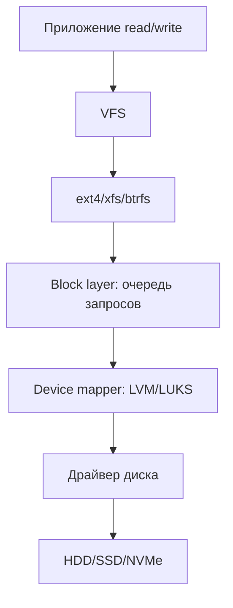

# 10 — Блочный I/O

**Мнемоника: BDF** — *Block layer → Device → Filesystem*

## Схема I/O stack



## Таблица

| Компонент | Роль | Команда | Метрика |
|-----------|------|---------|---------|
| Block layer | merge, scheduler | `cat /sys/block/sda/queue/scheduler` | — |
| I/O scheduler | mq-deadline/none | выше | latency vs throughput |
| LVM | тома | `lvdisplay`, `pvs` | — |
| LUKS | шифрование | `lsblk -f`, `cryptsetup status` | — |
| SMART | здоровье диска | `smartctl -a /dev/sda` | Reallocated_Sector |

## Дерево решений

```
Диск тормозит?
├── iowait высокий? → iostat -x 1
├── Кто пишет? → iotop -o
├── Очередь переполнена? → cat /sys/block/*/queue/nr_requests
└── Диск умирает? → smartctl -H /dev/sdX
```

## Команды

```bash
lsblk -f
iostat -x 1 3 2>/dev/null || echo "установи sysstat"
cat /proc/diskstats | head -5
```

## Практика

→ `hash_checker.sh` (контроль целостности критичных файлов)