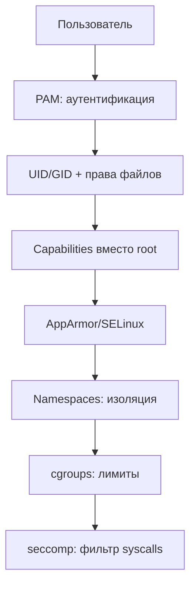

# 12 — Безопасность Linux

**Мнемоника: CAPNS** — *Capabilities, AppArmor, PAM, Namespaces, Seccomp*

## Схема защиты в глубину



## Таблица механизмов

| Механизм | Что ограничивает | Команда | Пример |
|----------|------------------|---------|--------|
| DAC | owner/group/other | `ls -la`, `chmod` | 644, 755 |
| ACL | расширенные права | `getfacl` | setfacl -m |
| Capabilities | части root | `getcap`, `capsh` | cap_net_bind |
| AppArmor | профили программ | `aa-status` | enforce/complain |
| SELinux | контексты | `sestatus`, `ls -Z` | targeted policy |
| Namespaces | PID/net/mount/UTS | `lsns`, `unshare` | Docker |
| cgroups v2 | ресурсы | `/sys/fs/cgroup/` | memory.max |
| seccomp | syscalls | `/proc/PID/status` Seccomp | Docker default |

## SUID / SGID — аудит

| Флаг | Риск | Команда |
|------|------|---------|
| SUID | запуск от root | `find / -perm -4000 2>/dev/null` |
| SGID | групповые права | `find / -perm -2000 2>/dev/null` |
| Sticky /tmp | защита от удаления чужих | `ls -ld /tmp` |

## Дерево решений

```
Компрометация / hardening?
├── Лишние SUID? → find + hash_checker
├── Открытые порты? → port_scanner
├── Brute force SSH? → log_analyzer auth.log
├── Контейнер сбежал? → capsh, lsns
└── CVE в пакете? → cve_monitor.py
```

## Команды

```bash
id
sudo -l 2>/dev/null
find /usr/bin /usr/sbin -perm -4000 -ls 2>/dev/null | head -20
aa-status 2>/dev/null || sestatus 2>/dev/null || echo "LSM: проверь вручную"
```

## Практика

→ все скрипты `bash-security-toolkit/`
→ `cyber-hygiene/ncsc-10-steps.md`